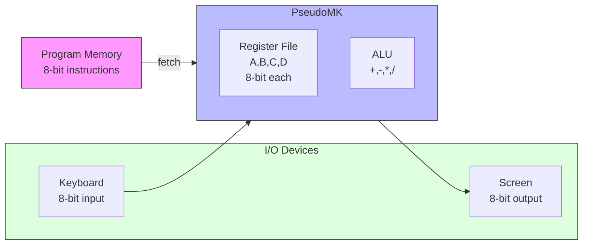

# PseudoMK Emulator

An emulator for a simple 8-bit calculator (PseudoMK) with basic arithmetic operations and I/O capabilities.

## Overview

PseudoMK is a hypothetical 8-bit calculator with four 8-bit registers (A, B, C, D) that can perform basic arithmetic operations and interact with keyboard/screen.

### Architecture



## Instruction Set

### Register File
| Register | Encoding (binary) |
|----------|-------------------|
| A        | `00`              |
| B        | `01`              |
| C        | `10`              |
| D        | `11`              |

### Instructions
| Mnemonic   | Encoding (binary) | Description                       |
|------------|-------------------|-----------------------------------|
| `MOVI Imm` | `0IIIIIII`        | Move constant to D register       |
| `ADD R, R` | `1000RRRR`        | Add two registers modulo 256      |
| `SUB R, R` | `1001RRRR`        | Subtract two registers modulo 256 |
| `MUL R, R` | `1010RRRR`        | Multiply two registers modulo 256 |
| `DIV R, R` | `1011RRRR`        | Divide two registers modulo 256   |
| `IN R`     | `110000RR`        | Read register R from keyboard     |
| `OUT R`    | `110001RR`        | Write register R to screen        |

## Implementation Details

- All arithmetic operations are performed modulo 256 (8-bit)
- Instructions are encoded in 8-bit format
- First bit of instruction determines its type:
    - 0: Immediate data operations (MOVI)
    - 1: Register operations and I/O

## Example Program

```
In: 0x70 0xc7 0xc1 0x87

Disassembled:
MOVI 112    ; Load 112 into D register
OUT D       ; Output D register to screen
IN B        ; Input from keyboard to B register
ADD B, D    ; Add B and D registers
```